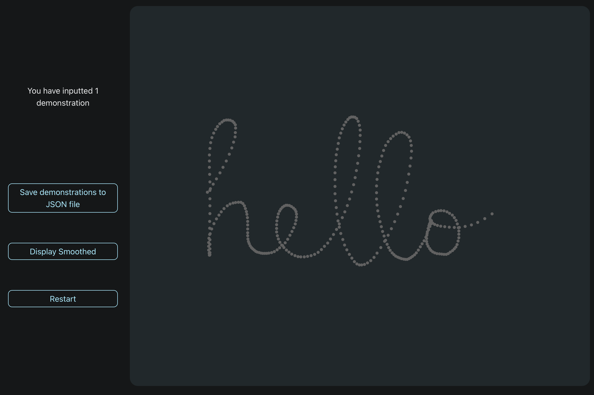

# Improving the SeGM Algorithm for More Flexible Segmentation

This project is based on the paper:
**Segment, Compare and Learn: Creating Movement Libraries of Complex Task for Learning from Demonstration**.

# Installation

## Segmentation Algorithm

Create a conda environment and activate it:

```
conda env create -f environment.yml
conda activate SeGM
```

Then, navigate to the `SegmentationProb/scripts` folder:

```
cd SegmentationProb/scripts
```

To run the segmentation algorithm on a demonstration file, using the following command:

```
python ModSegment.py <file>
```

For example:

```
python ModSegment.py hello.json
```

To add new demonstrations, you must put the files in `SegmentationProb/json files` or in `SegmentationProb/h5 files` depending on the data format.

## Stylus Tracker

This is a React Native app that records writing demonstrations. It is built using Expo. To run the app, you need to download [Expo Go](https://expo.dev/go) on your tablet.

***Compatibility:** Expected to work on iOS and Android, but only tested on iPad.*

Navigate to the `StylusTracker` folder:

```
cd StylusTracker
```

Then, install dependencies:

```
npm install
```

Finally, start the expo app:

```
npx expo start
```

A QR code will appear on the terminal. Scan the QR code with your tablet to launch the app with Expo Go.

<picture>
  <source media="(prefers-color-scheme: dark)" srcset="./Images/app_dark.PNG">
  <source media="(prefers-color-scheme: light)" srcset="./Images/app_light.PNG">
  
</picture>
